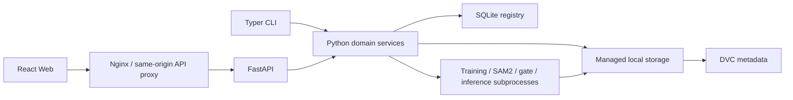

# TrainForge

> 可扩展的开源模型工程平台：统一管理数据准备、标注、训练、评估、发布与推理。

[](LICENSE)
[](CHANGELOG.md)
[](.github/workflows/ci.yml)
[](https://github.com/idCntrue/TrainForge/stargazers)
[](pyproject.toml)
[](frontend/package.json)

<!-- TODO: 补充在线 Demo，例如 https://demo.example.com。公开 Demo 必须先增加访问控制并使用脱敏数据。 -->
<!-- TODO: 补充文档站点，例如 https://docs.example.com。 -->
<!-- TODO: 在 docs/assets/ 放置 1200x630 的项目封面或不超过 10 MB 的演示 GIF，并在此处引用。 -->

**在线 Demo：** <!-- TODO: 补充 Demo URL --> · **文档站点：** <!-- TODO: 补充文档 URL -->

## 目录

- [项目介绍](#about)
- [核心功能](#features)
- [技术栈](#tech-stack)
- [快速开始](#quick-start)
- [使用指南](#usage)
- [配置说明](#configuration)
- [数据与安全说明](#security)
- [部署指南](#deployment)
- [贡献指南](#contributing)
- [常见问题](#faq)
- [路线图](#roadmap)
- [开源协议](#license)
- [致谢](#acknowledgments)

<a id="about"></a>
## 📖 项目介绍 / About

TrainForge 是一个单机优先、可扩展的全栈模型工程平台。当前版本以计算机视觉和 YOLO 工作流为核心，把视频/图片归档、抽帧筛选、原生标注、数据集冻结、Ultralytics 训练、模型门禁和异步推理串成可追溯流程；架构可继续扩展其他训练引擎和模型类型。它解决了团队在脚本、目录和人工记录之间反复切换时常见的版本混乱、路径失效、数据泄漏和模型来源不清问题。

### 为什么使用它

- **数据到模型全链路：** 同一界面管理任务、数据、标注、训练、模型和推理，不以演示数据替代真实执行。
- **不可变发布：** 训练只引用已发布的数据集版本；模型版本记录数据集、训练配置、权重和门禁结果。
- **检测与分割统一：** 同时支持 YOLO detect 与 segment，原生框/多边形标注以及 SAM2 点选辅助分割。
- **资源受限保护：** CPU/GPU 参数上限、磁盘余量门禁、单重型任务互斥和失败诊断降低共享服务器失稳风险。
- **云端路径安全：** 浏览器上传文件，数据库保存受管存储键；部署脚本保留线上 `.env`、数据卷和 SQLite。
- **Web 与 CLI 并存：** 常用操作面向普通用户，底层数据流水线仍可通过 `yolo-factory` 自动化。

### 适用场景

- 企业内网中的小型算法团队或单机训练服务器。
- 需要管理多个检测/分割任务和数据集版本的项目。
- 需要从图片/视频到 PT、ONNX 和推理结果的完整追踪。
- CPU 环境的数据治理、轻量训练和 ONNX 推理，或单机 NVIDIA GPU 训练。

### 不适用场景

- 当前版本没有登录、租户隔离和细粒度权限，不应直接暴露到公网。
- 当前任务队列和回收站清理器按单 API 实例设计，不支持多副本横向扩展。
- 本地对象存储是当前实现；阿里云 OSS 仅预留接口，尚未提供自动迁移。
- 不适合替代专业分布式训练平台、标注众包平台或模型在线服务集群。

### 架构



API 主进程保持单 Uvicorn worker；Torch、Ultralytics 和 ONNX Runtime 等重型依赖由训练、门禁、SAM2 或推理子进程加载。

<a id="features"></a>
## ✨ 核心功能 / Features

### 数据准备

- 浏览器上传图片和视频，按 SHA-256 归档并跳过重复内容。
- 视频检查、定间隔抽帧、JPEG 质量控制、感知哈希近重复检测。
- 向已有批次追加图片或视频；新抽取帧进入 `candidate` 待筛选状态。
- 分页筛选、跨页批量操作、7 天图片回收站和主动永久删除。

### 标注与数据集

- 原生框、多边形、顶点编辑、类别选择、审核锁定与退回修改。
- SAM2 Tiny/Small 正负点交互预览和辅助分割。
- 原生 YOLO 标注导出与 Roboflow ZIP 导入。
- train/val/test 可复现划分、结构校验、类别校验和不可变数据集版本。

### 训练与质量

- YOLOv8、YOLO11、YOLO26 预设和自定义 Ultralytics `.pt` 权重上传。
- 按数据集 class 子集训练，并支持显示别名。
- `smoke`、`cpu-balanced`、`gpu-quality` 训练预设。
- 独立进程训练、Epoch 进度、日志、取消、服务重启恢复和安全重试。
- 独立 test 集评估、数据质量报告、失败原因分类和最佳权重恢复评估。

### 模型与推理

- 候选模型登记、PT/ONNX 制品管理、opset 17 导出和一致性门禁。
- 模型发布、归档和依赖安全删除。
- PT/CUDA 与 ONNX/CPU 的单图、多图和视频异步推理。
- 结构化结果、输出媒体、运行进度和历史记录。

<a id="tech-stack"></a>
## 🛠️ 技术栈 / Tech Stack

| 层级 | 核心技术 |
| --- | --- |
| 前端 | React 19、TypeScript 5、Vite 7、Ant Design 5、Konva 10、Recharts 3、Vitest 3 |
| API / CLI | Python 3.10、FastAPI 0.116、Uvicorn 0.35、Typer 0.16、Pydantic 2.11 |
| 数据库 | SQLite 3、SQLAlchemy 2.0、Alembic 1.16；WAL 与外键约束开启 |
| 视觉与训练 | Ultralytics 8.4.95、PyTorch 2.8、OpenCV 4.11、ONNX 1.18、ONNX Runtime 1.22 |
| 数据工程 | Datumaro 1.12、DVC 3.67、Pillow、ImageHash、PyYAML |
| 基础设施 | Docker Compose、Nginx 1.27 Alpine、CPU 与 CUDA 12.8.1 镜像 |
| 质量工具 | pytest 8、pytest-cov 6、pre-commit、GitHub Actions |

<a id="quick-start"></a>
## 🚀 快速开始 / Quick Start

### 环境要求

- Python `3.10.x`（项目声明 `>=3.10,<3.11`）。
- Node.js 22 与 npm（Docker 构建使用 `node:22-alpine`）。
- Git、FFmpeg；训练和推理建议安装可用的系统编解码器。
- 可选：Docker Engine 28+ 与 Docker Compose 插件。
- 可选 GPU：NVIDIA 驱动、NVIDIA Container Toolkit，以及与 CUDA 12.8 镜像兼容的设备。

### 安装

```bash
git clone https://github.com/idCntrue/TrainForge.git
cd TrainForge

python3.10 -m venv .venv
source .venv/bin/activate
python -m pip install --upgrade pip
python -m pip install -e ".[dev]"

cd frontend
npm ci
cd ..
```

Windows PowerShell 激活虚拟环境：

```powershell
.\.venv\Scripts\Activate.ps1
```

### 初始化 SQLite 与本地数据目录

仓库不提供真实数据库或业务数据。创建仅供本机使用、已被 `.gitignore` 忽略的配置：

```yaml
# configs/system.local.yaml
storage_root: ./.local-data
```

```bash
yolo-factory init-storage --system configs/system.local.yaml
```

该命令创建 `.local-data/registry/factory.db`、受管数据目录和 DVC 元数据。表结构来自 SQLAlchemy 模型，并由 `src/yolo_factory/migrations/` 中的迁移代码增量维护；无需导入 SQL dump。

### 本地运行

终端 1：

```bash
export YOLO_FACTORY_SYSTEM_CONFIG=configs/system.local.yaml
uvicorn yolo_factory.api.app:create_app --factory --host 127.0.0.1 --port 8000
```

PowerShell 对应命令：

```powershell
$env:YOLO_FACTORY_SYSTEM_CONFIG = "configs/system.local.yaml"
python -m uvicorn yolo_factory.api.app:create_app --factory --host 127.0.0.1 --port 8000
```

终端 2：

```bash
cd frontend
npm run dev -- --host 127.0.0.1 --port 53257 --strictPort
```

验证：

- Web：<http://127.0.0.1:53257/>
- Swagger：<http://127.0.0.1:8000/docs>
- 健康检查：`curl http://127.0.0.1:8000/api/health`
- 健康响应包含 `{"status":"ok"}` 和当前 `storage_root`。

Windows 也可在依赖安装后运行：

```powershell
.\scripts\start-ui.ps1
```

### 运行测试

```bash
python -m pytest -q

cd frontend
npm test -- --run
npm run build
```

<a id="usage"></a>
## 📚 使用指南 / Usage

### Web 工作流

1. **任务管理：** 创建 `detect` 或 `segment` 任务，确认 class 顺序和显示名称。
2. **数据导入：** 上传图片，或上传视频并创建抽帧批次；可继续向已有批次追加素材。
3. **数据筛选：** 处理待筛选帧、重复帧和低质量内容，保存为已保留状态。
4. **原生标注：** 创建框或多边形；分割任务可使用 SAM2 辅助，完成后提交复核。
5. **数据集版本：** 导出标注并发布带显示名称的不可变版本。
6. **训练运行：** 选择数据集、基础权重、class 子集、设备和预设，观察日志与质量报告。
7. **模型中心：** 登记训练结果、执行 PT/ONNX 门禁，通过后发布。
8. **推理工作台：** 上传图片或视频，选择 PT/CUDA 或 ONNX/CPU 查看结果。

<!-- TODO: 为任务管理、数据筛选、原生标注、训练详情、模型门禁和推理页面各补充一张 1440px 宽的脱敏截图。 -->

### CLI 命令

运行 `yolo-factory --help` 或 `yolo-factory <COMMAND> --help` 查看完整参数。

| 命令 | 用途 |
| --- | --- |
| `init-storage` | 初始化受管目录、SQLite 表和 DVC |
| `migrate-storage-paths` | 将旧存储根路径迁移到新根；默认 dry-run，`--apply` 才写入 |
| `video-import` | 归档目录中的视频并登记集合 |
| `video-inspect` | 输出视频编码、尺寸、帧率等检查结果 |
| `frame-extract` | 按间隔从单个视频抽帧 |
| `frame-deduplicate` | 使用感知哈希查找近重复图片 |
| `selection-sync` | 将批次筛选状态同步到数据库与 manifest |
| `annotation-package` | 生成用于外部标注的图片包 |
| `annotation-import` | 导入并校验 Roboflow 标注 ZIP |
| `dataset-check` | 校验数据集结构与标签 |
| `dataset-release` | 创建不可变数据集版本 |

示例：先预览历史路径迁移，不修改数据库：

```bash
yolo-factory migrate-storage-paths \
  --database /data/registry/factory.db \
  --old-root 'D:\YOLO_DATA' \
  --new-root /data
```

确认报告后再增加 `--apply`。工具会先创建 SQLite 备份，并在事务中更新路径。

<a id="configuration"></a>
## ⚙️ 配置说明 / Configuration

### Docker 环境变量

从模板复制，真实 `.env` 不得提交：

```bash
cp .env.docker.example .env
```

| 变量 | 默认值 | 作用 |
| --- | --- | --- |
| `DATA_DIR` | `/srv/yolo-factory/data` | 宿主机持久化数据根目录 |
| `MODEL_DIR` | `/srv/yolo-factory/models` | 宿主机只读模型权重目录 |
| `WEB_PORT` | `8080` | Web 对外端口 |
| `IMAGE_TAG` | `latest` | API/Web 镜像标签 |
| `CORS_ALLOWED_ORIGINS` | 空 | 逗号分隔的跨域来源；同源代理无需填写 |
| `API_MEMORY_LIMIT` | `10g` | API 容器内存硬限制 |
| `API_CPU_LIMIT` | `6` | API 容器 CPU 配额 |
| `API_SHM_SIZE` | `2gb` | API 容器共享内存 |
| `API_PIDS_LIMIT` | `256` | API 容器进程数上限 |
| `CPU_TRAINING_THREADS` | `4` | CPU 训练线程数，必须为正整数 |
| `CPU_DETECT_MAX_BATCH` | `4` | CPU 检测最大 Batch |
| `CPU_SEGMENT_MAX_BATCH` | `1` | CPU 分割最大 Batch |
| `CPU_TRAINING_MAX_IMAGE_SIZE` | `640` | CPU 最大输入尺寸 |
| `GPU_DETECT_MAX_BATCH` | `8` | GPU 检测最大 Batch |
| `GPU_SEGMENT_MAX_BATCH` | `2` | GPU 分割最大 Batch |
| `GPU_TRAINING_MAX_IMAGE_SIZE` | `1280` | GPU 最大输入尺寸 |
| `GPU_ALLOWED_DEVICES` | 空 | 允许的设备列表；空表示允许可见 GPU |
| `YOLO_FACTORY_MAX_UPLOAD_BYTES` | `2147483648` | 单文件流式上传上限（2 GiB） |
| `TRAINING_MIN_FREE_DISK_GB` | `10` | 创建训练前要求的最小空闲 GiB |
| `TRAINING_MIN_FREE_DISK_PERCENT` | `10` | 创建训练前要求的最小空闲百分比，1-100 |

完整模板：

```dotenv
DATA_DIR=/srv/yolo-factory/data
MODEL_DIR=/srv/yolo-factory/models
WEB_PORT=8080
IMAGE_TAG=latest
CORS_ALLOWED_ORIGINS=
API_MEMORY_LIMIT=10g
API_CPU_LIMIT=6
API_SHM_SIZE=2gb
API_PIDS_LIMIT=256
CPU_TRAINING_THREADS=4
CPU_DETECT_MAX_BATCH=4
CPU_SEGMENT_MAX_BATCH=1
CPU_TRAINING_MAX_IMAGE_SIZE=640
GPU_DETECT_MAX_BATCH=8
GPU_SEGMENT_MAX_BATCH=2
GPU_TRAINING_MAX_IMAGE_SIZE=1280
GPU_ALLOWED_DEVICES=
YOLO_FACTORY_MAX_UPLOAD_BYTES=2147483648
TRAINING_MIN_FREE_DISK_GB=10
TRAINING_MIN_FREE_DISK_PERCENT=10
```

### 应用配置

| 变量 | 默认值 | 作用 |
| --- | --- | --- |
| `YOLO_FACTORY_SYSTEM_CONFIG` | `configs/system.yaml` | 包含 `storage_root` 的系统配置路径 |
| `YOLO_FACTORY_TASK_CONFIG_DIR` | `configs/tasks` | 任务 YAML 目录；Docker 使用 `/data/task-configs` |
| `YOLO_FACTORY_MODEL_DIR` | 未设置 | 受管模型权重目录；Docker 使用 `/models` |
| `VITE_API_BASE_URL` | `/api` | 前端 API 根路径；生产镜像固定为同源 `/api` |

开发环境建议使用被忽略的 `configs/system.local.yaml`；生产环境通过 `.env` 和只读模型卷注入配置。不要把机器绝对路径、凭据或业务任务配置写入公共模板。

<a id="security"></a>
## 🔒 数据与安全说明

公共仓库只应包含 SQLAlchemy 表结构和 `src/yolo_factory/migrations/` 中的迁移代码，**不包含任何真实业务数据、用户数据、标注数据、本地调试数据或数据库 dump**。

禁止提交：

- `*.db`、`*.sqlite*`、`*.sql` dump、WAL/SHM、Access 数据库。
- `.env*`（模板除外）、本机配置、Token、密码、API Key、SSH 私钥和证书。
- 原始视频、抽帧图片、标注 ZIP、数据集版本、训练运行、推理结果。
- `*.pt`、`*.onnx`、TensorRT engine 和其他模型制品。
- 日志、浏览器配置、IDE 状态、缓存、虚拟环境、`node_modules` 和构建包。

SQLite 安全备份示例：

```bash
docker compose exec -T api python3.10 -c \
  "import sqlite3; s=sqlite3.connect('/data/registry/factory.db'); d=sqlite3.connect('/data/registry/factory.backup.db'); s.backup(d); d.close(); s.close()"
```

备份应与数据目录、模型目录保持同一时间点，存放到访问受控、加密且有生命周期策略的位置。恢复前停止写入并校验 `PRAGMA integrity_check`。含人员、设备、场所或生产图像的数据应遵循所在组织的数据分类、最小化、授权、留存和删除政策。

本项目当前不包含鉴权。仅应部署到可信内网、VPN 或带身份认证的反向代理后方。

<a id="deployment"></a>
## 📦 部署指南 / Deployment

### CPU Docker 部署

```bash
git clone https://github.com/idCntrue/TrainForge.git /opt/yolo_model_factory
cd /opt/yolo_model_factory
cp .env.docker.example .env

sudo mkdir -p /srv/yolo-factory/data /srv/yolo-factory/models
# TODO: 将目录所有者替换为运行 Docker Compose 的专用服务账户。
sudo chown -R "$USER":"$USER" /srv/yolo-factory

docker compose config --quiet
docker compose up -d --build
docker compose ps
curl http://127.0.0.1:8080/api/health
```

容器入口会初始化 `/data` 目录和 SQLite 表。仓库不会向该卷导入业务数据。

### NVIDIA GPU 部署

```bash
docker compose -f compose.yaml -f compose.gpu.yaml up -d --build
docker compose -f compose.yaml -f compose.gpu.yaml exec -T api \
  python3.10 -c "import torch; print(torch.__version__, torch.version.cuda, torch.cuda.is_available()); assert torch.cuda.is_available()"
```

GPU 镜像使用 CUDA 12.8.1、PyTorch 2.8.0 和 cu128 wheel。宿主机必须先安装兼容驱动和 NVIDIA Container Toolkit。

### 安全更新

已有实例推荐使用包更新器。它继承线上 `.env`，构建新镜像，在线备份 SQLite，健康检查失败时回滚，并且不会替换数据卷或模型卷：

```bash
sudo sh -c "tar -xOf /tmp/yolo-model-factory-deploy.tar.gz yolo_model_factory/docker/update-from-package.sh | sh -s -- /tmp/yolo-model-factory-deploy.tar.gz"
```

### 反向代理与域名

- `web` 容器内的 Nginx 已将 `/api/` 同源代理到 API，并允许最大 2 GiB 请求体。
- 生产域名应由外层 Nginx、Ingress 或云负载均衡终止 TLS。
- 不要直接暴露 API 容器端口；只发布 `WEB_PORT`。
- 在安全组中限制来源 IP，或在外层代理增加企业 SSO/VPN/Basic Auth。
- `.env` 只保存在服务器，GitHub Actions 使用 Environment Secrets 注入 `DEPLOY_HOST`、`DEPLOY_USER` 和 `DEPLOY_SSH_KEY`。

### 数据库迁移

普通结构迁移在 API 初始化时执行。历史 Windows 路径迁移先 dry-run：

```bash
docker compose run --rm api yolo-factory migrate-storage-paths \
  --database /data/registry/factory.db \
  --old-root 'D:\YOLO_DATA' \
  --new-root /data
```

核对 `external_paths` 和 `missing_paths` 后才可增加 `--apply`。不要把生产数据库复制回代码仓库。

<a id="contributing"></a>
## 🤝 贡献指南 / Contributing

1. Fork 仓库并从 `main` 创建分支：`git switch -c feat/short-description`。
2. 按[快速开始](#quick-start)安装开发依赖。
3. 先增加测试，再实现修改；保持领域模块边界和受管路径规则。
4. 运行 `python -m pytest -q`、`npm test -- --run` 和 `npm run build`。
5. 使用 Conventional Commits，例如 `feat: add dataset filter`、`fix: preserve storage keys`。
6. 推送分支并创建 Pull Request，说明行为变化、测试证据、数据迁移和回滚方式。

提交前建议安装检查器：

```bash
python -m pip install pre-commit
pre-commit install
pre-commit run --all-files
```

Issue 应提供最小复现、期望/实际行为、环境和脱敏日志；PR 应聚焦单一问题。**禁止提交本地配置、数据库、业务任务 YAML、媒体、标注、模型、日志、服务器地址或任何凭据。** 安全问题请遵循 [SECURITY.md](SECURITY.md)，不要公开披露敏感细节。

<a id="faq"></a>
## 📝 常见问题 / FAQ

### 为什么启动时报 `configs/system.yaml` 或存储目录错误？

创建 `configs/system.local.yaml`，并在启动 API 前设置 `YOLO_FACTORY_SYSTEM_CONFIG=configs/system.local.yaml`。确认当前用户对 `storage_root` 有读写权限。

### 为什么前端能打开但 API 请求失败？

开发模式确认 API 位于 `127.0.0.1:8000`；Vite 会代理 `/api`。Docker 模式检查 `docker compose ps` 和 `curl http://127.0.0.1:$WEB_PORT/api/health`。

### 为什么训练请求被拒绝？

检查 Batch、图像尺寸、设备和磁盘余量。默认要求至少 10 GiB 且 10% 空闲；CPU 分割 Batch 上限为 1。

### 为什么训练中途出现 `resource_limit / exit -9`？

这表示训练子进程收到外部 `SIGKILL`，常见于容器或宿主机 OOM。检查 `memory.events`、内核 OOM 日志和容器限制；使用安全重试降低 Batch 或图像尺寸。

### 为什么 Docker 构建出现 `unexpected EOF`？

通常是拉取基础镜像时网络中断。先检查磁盘，再单独 `docker pull node:22-alpine`、`nginx:1.27-alpine` 和 `python:3.10-slim-bookworm` 后重试。

### 可以把现有数据库作为示例提交吗？

不可以。测试通过 pytest 临时目录创建数据库；公共示例只提交模型定义、迁移代码和匿名 YAML，不提交数据库文件或 dump。

### 如何补充 FAQ？

按“问题标题 → 原因 → 可验证命令 → 解决步骤”的格式提交 PR，日志和路径必须脱敏。

<a id="roadmap"></a>
## 🗺️ 路线图 / Roadmap

### 已完成

- [x] 图片/视频归档、抽帧、去重、筛选、追加和回收站。
- [x] 检测/分割原生标注与 SAM2 辅助分割。
- [x] 标注导入导出、不可变数据集版本和质量校验。
- [x] CPU/GPU 资源策略、真实 Ultralytics 训练和失败恢复。
- [x] 模型门禁、PT/ONNX 发布和异步推理。
- [x] CPU/GPU Docker 编排、安全升级脚本和 GitHub Actions 流程。

### 规划中

- [ ] 对象存储实现与本地数据到 OSS 的可验证迁移。
- [ ] 远程 GPU Worker 和持久化任务队列。
- [ ] 多实例安全的调度与回收站清理。
- [ ] 可选的企业访问控制和审计日志。
- [ ] 前端进一步代码分割与性能预算。
- [ ] FastAPI lifespan 迁移和更完整的可观测性。

<a id="license"></a>
## 📄 开源协议 / License

TrainForge 采用 [GNU Affero General Public License v3.0](LICENSE)。任何人均可在 AGPL-3.0 条款下使用、修改和再发布本项目；如果修改后的版本通过网络向用户提供服务，必须向这些用户提供对应版本的完整源码。

数据库、业务数据、标注数据、模型权重、运行配置和凭据不属于本仓库发布内容。第三方组件仍分别遵循其自身许可证，详见 [THIRD_PARTY_LICENSES.md](THIRD_PARTY_LICENSES.md)。

<a id="acknowledgments"></a>
## 🙏 致谢 / Acknowledgments

感谢以下项目及其社区：

- [Ultralytics](https://github.com/ultralytics/ultralytics)
- [FastAPI](https://github.com/fastapi/fastapi)
- [React](https://github.com/facebook/react)
- [Ant Design](https://github.com/ant-design/ant-design)
- [OpenCV](https://github.com/opencv/opencv)
- [Datumaro](https://github.com/openvinotoolkit/datumaro)
- [DVC](https://github.com/iterative/dvc)
- [ONNX Runtime](https://github.com/microsoft/onnxruntime)

<!-- TODO: 补充贡献者名单、项目 Logo 来源和经许可使用的设计素材。 -->

---

## 开源发布前专项建议

1. 在首次公开 push 前删除本地模型权重、日志、浏览器 QA 数据、构建包和内部部署文档，并用 `git status --ignored` 复核。
2. 对完整 Git 历史运行 secret scanner；仅添加 `.gitignore` 不能清除历史中已经提交的数据库、密钥或服务器信息。
3. 将内部任务 YAML 替换为匿名示例，真实类别、设备名称、场所信息和标注数据保留在私有数据仓库。
4. 完成 Ultralytics AGPL-3.0 兼容性与其他依赖许可证清单，添加正式 `LICENSE`、NOTICE/SBOM 后再公开发布。
5. 公共 Demo 必须使用合成或明确授权的数据，并置于鉴权、TLS、访问日志脱敏和限流之后。
