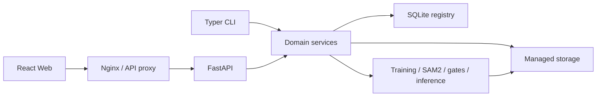

# TrainForge

<p align="center">
  <strong>从原始数据到可发布模型的一体化开源模型工程平台</strong>
</p>

<p align="center">
  <a href="README.md">简体中文</a> · <a href="README_EN.md">English</a>
</p>

<p align="center">
  <a href="LICENSE"></a>
  <a href="CHANGELOG.md"></a>
  <a href="https://github.com/idCntrue/TrainForge/actions/workflows/ci.yml"></a>
  <a href="https://github.com/idCntrue/TrainForge/stargazers"></a>
  
  
</p>


TrainForge 将数据导入、筛选、标注、数据集发布、训练、评估、模型门禁与推理组织成一条可追溯的工作流。当前版本聚焦 YOLO 检测与分割，同时保留扩展其他训练引擎和模型类型的架构边界。

> 项目仍处于早期阶段，适合单机或小型团队环境。欢迎通过 Issue 和 Pull Request 参与改进。

## 为什么选择 TrainForge

- **完整工作流：** 不再用脚本、目录和表格拼接数据到模型的过程。
- **可追溯发布：** 数据集、训练参数、权重、评估结果与模型状态保持关联。
- **检测与分割统一：** 支持 YOLO detect/segment、框与多边形标注、SAM2 辅助分割。
- **面向受限服务器：** 提供 CPU/GPU 参数上限、训练前安全清理、8 GiB/10% 磁盘门禁、重型任务互斥和基于 cgroup 证据的失败诊断。
- **真实执行而非静态 Demo：** Web 与 CLI 都调用同一套领域服务和受管存储。
- **部署更新保护：** Docker 更新脚本保留 `.env`、数据目录、模型目录和 SQLite 数据库。

## 产品导览

| 数据准备与筛选 | 原生标注 |
| --- | --- |
|  |  |
| 上传图片或视频、抽帧、去重、分页筛选，并向已有批次继续追加素材。 | 在同一工作台完成框、多边形、类别管理、审核与 SAM2 辅助分割。 |

| 训练与质量分析 | 模型中心 |
| --- | --- |
|  |  |
| 查看资源策略、Epoch 进度、指标趋势、失败原因和面向普通用户的质量结论。 | 管理 PT/ONNX 制品、运行一致性门禁，并控制候选、发布和归档状态。 |

### 移动端与平板

TrainForge 使用同一套 React 应用提供自适应信息架构。当视口宽度不超过 `900px` 时，桌面侧栏会切换为固定底部导航，列表、抽屉和标注工作台使用更适合触控的布局，业务接口与数据保存逻辑保持一致。

<p align="center">
  
  &nbsp;&nbsp;
  
</p>

<p align="center"><sub>固定底部导航、单列卡片和 iPhone 安全区适配</sub></p>

## 核心能力

### 数据与标注

- 浏览器流式上传图片和视频，按 SHA-256 归档并跳过重复内容。
- 视频检查、定间隔抽帧、JPEG 质量控制和感知哈希近重复检测。
- 已有批次追加图片或视频，新帧进入待筛选状态。
- 分页筛选、跨页批量操作、7 天回收站和主动永久删除。
- 框、多边形、顶点编辑、类别选择、审核锁定与退回修改。
- SAM2 Tiny/Small 正负点预览和辅助分割。
- 原生 YOLO 导出、Roboflow ZIP 导入和不可变数据集版本。

### 训练、模型与推理

- YOLOv8、YOLO11、YOLO26 预设及自定义 Ultralytics 权重。
- `smoke`、`cpu-balanced`、`gpu-quality` 训练预设和 class 子集训练。
- 独立进程训练、进度与日志、取消、重启恢复，以及兼容普通 HTTP 环境的幂等安全重试。
- 训练前仅清理可再生成缓存和过期暂存文件；SQLite、数据集、标注、权重和正式训练产物不在自动清理范围内。
- 记录 cgroup 内存限制、当前值、峰值和本次运行的 OOM kill 增量，区分已确认 OOM 与原因未确认的外部 `SIGKILL`。
- test 集评估、数据质量报告、类别指标和最佳权重恢复评估。
- PT/ONNX 制品管理、opset 17 导出、一致性门禁、发布和归档。
- PT/CUDA 与 ONNX/CPU 的图片、批量图片和视频异步推理。

## 技术架构



| 层级 | 技术 |
| --- | --- |
| 前端 | React 19、TypeScript 5、Vite 7、Ant Design 5、Konva 10、Recharts 3 |
| API / CLI | Python 3.10、FastAPI、Uvicorn、Typer、Pydantic 2 |
| 数据 | SQLite、SQLAlchemy 2、Alembic、DVC、受管本地存储 |
| 视觉与训练 | Ultralytics、PyTorch、OpenCV、ONNX、ONNX Runtime、Datumaro |
| 部署与质量 | Docker Compose、Nginx、pytest、Vitest、GitHub Actions |

## 快速开始

### Docker Compose

```bash
git clone https://github.com/idCntrue/TrainForge.git
cd TrainForge
cp .env.docker.example .env

mkdir -p .local-data .local-models
DATA_DIR="$PWD/.local-data" MODEL_DIR="$PWD/.local-models" docker compose up -d --build

docker compose ps
curl http://127.0.0.1:8080/api/health
```

浏览器访问 <http://127.0.0.1:8080>。容器会在挂载的数据目录中初始化 SQLite；仓库不附带业务数据库或训练数据。

### 本地开发

环境要求：Python `3.10.x`、Node.js 22、npm、Git 和 FFmpeg。

```bash
git clone https://github.com/idCntrue/TrainForge.git
cd TrainForge

python3.10 -m venv .venv
source .venv/bin/activate
python -m pip install --upgrade pip
python -m pip install -e ".[dev]"

cd frontend
npm ci
cd ..
```

创建不提交到 Git 的 `configs/system.local.yaml`：

```yaml
storage_root: ./.local-data
```

启动 API：

```bash
export YOLO_FACTORY_SYSTEM_CONFIG=configs/system.local.yaml
yolo-factory init-storage --system configs/system.local.yaml
uvicorn yolo_factory.api.app:create_app --factory --host 127.0.0.1 --port 8000
```

启动前端：

```bash
cd frontend
npm run dev -- --host 127.0.0.1 --port 53257 --strictPort
```

- Web：<http://127.0.0.1:53257>
- Swagger：<http://127.0.0.1:8000/docs>
- 健康检查：<http://127.0.0.1:8000/api/health>

Windows 可在安装依赖后运行 `scripts/start-ui.ps1`。

### 测试

```bash
python -m pytest

cd frontend
npm test -- --run
npm run build
```

## 使用流程

1. 创建 `detect` 或 `segment` 任务并确认 class 顺序。
2. 上传图片，或上传视频并创建抽帧批次。
3. 筛选候选帧，处理重复项和低质量内容。
4. 创建框或多边形标注，并提交复核。
5. 发布带显示名称和固定划分的数据集版本。
6. 选择数据集、基础权重、设备和资源预设开始训练。
7. 在模型中心登记训练结果并运行 PT/ONNX 门禁。
8. 发布通过门禁的模型，并在推理工作台验证图片或视频。

常用 CLI：

| 命令 | 用途 |
| --- | --- |
| `init-storage` | 初始化受管目录、SQLite 和 DVC |
| `migrate-storage-paths` | 预览或执行历史存储根路径迁移 |
| `video-import` / `video-inspect` | 归档和检查视频 |
| `frame-extract` / `frame-deduplicate` | 抽帧和近重复检测 |
| `selection-sync` | 同步批次筛选状态 |
| `annotation-package` / `annotation-import` | 导出图片包或导入标注 |
| `dataset-check` / `dataset-release` | 校验和发布数据集 |

运行 `yolo-factory --help` 查看完整参数。

## 配置

复制 Docker 模板后再按环境修改，真实 `.env` 不得提交：

```bash
cp .env.docker.example .env
```

| 变量 | 默认值 | 说明 |
| --- | --- | --- |
| `DATA_DIR` | `/srv/yolo-factory/data` | 宿主机持久化数据目录 |
| `MODEL_DIR` | `/srv/yolo-factory/models` | 宿主机模型目录 |
| `WEB_PORT` | `8080` | Web 对外端口 |
| `IMAGE_TAG` | `latest` | API/Web 镜像标签 |
| `API_MEMORY_LIMIT` | `10g` | API 容器内存硬限制 |
| `API_CPU_LIMIT` | `6` | API 容器 CPU 配额 |
| `CPU_TRAINING_THREADS` | `4` | CPU 训练线程数 |
| `CPU_DETECT_MAX_BATCH` | `4` | CPU 检测最大 Batch |
| `CPU_SEGMENT_MAX_BATCH` | `1` | CPU 分割最大 Batch |
| `GPU_DETECT_MAX_BATCH` | `8` | GPU 检测最大 Batch |
| `GPU_SEGMENT_MAX_BATCH` | `2` | GPU 分割最大 Batch |
| `YOLO_FACTORY_MAX_UPLOAD_BYTES` | `2147483648` | 单文件上传上限 |
| `TRAINING_MIN_FREE_DISK_GB` | `8` | 训练前最小空闲 GiB；仍建议保持 10-12 GiB 以上 |
| `TRAINING_MIN_FREE_DISK_PERCENT` | `10` | 训练前最小空闲百分比 |

完整配置参见 [.env.docker.example](.env.docker.example)。

## 数据与安全

TrainForge 不会在代码仓库中保存业务数据库、训练数据、标注文件、模型权重、运行日志或环境凭据。生产部署应通过反向代理或统一访问入口配置身份认证、HTTPS、访问控制和上传限制。

提交代码前，请确认数据库、媒体、数据集、模型制品、`.env`、令牌、密码、私钥、日志和内部任务配置未被纳入版本控制。完整安全边界和漏洞报告方式参见 [SECURITY.md](SECURITY.md)。

## 生产部署

```bash
git clone https://github.com/idCntrue/TrainForge.git /opt/yolo_model_factory
cd /opt/yolo_model_factory
cp .env.docker.example .env

sudo mkdir -p /srv/yolo-factory/data /srv/yolo-factory/models
sudo chown -R "$USER":"$USER" /srv/yolo-factory

docker compose config --quiet
docker compose up -d --build
docker compose ps
curl http://127.0.0.1:8080/api/health
```

GPU 部署：

```bash
docker compose -f compose.yaml -f compose.gpu.yaml up -d --build
docker compose -f compose.yaml -f compose.gpu.yaml exec -T api \
  python3.10 -c "import torch; print(torch.cuda.is_available()); assert torch.cuda.is_available()"
```

部署注意事项：

- 只发布 Web 端口，不直接暴露 API 容器端口。
- 在外层 Nginx、Ingress 或云负载均衡终止 TLS 并接入认证。
- `.env`、数据目录、模型目录和数据库必须位于持久化、受控的位置。
- 部署前备份并验证数据，任何迁移先在副本上演练。

Windows 发布者可使用受测脚本生成不包含数据库、权重、日志和本机配置的更新包：

```powershell
./scripts/package-deploy.ps1
```

脚本会输出完整路径、文件大小和 SHA-256，并验证 `registry`、`models`、API、Compose 与更新脚本均已纳入归档。

### 云端数据同步到 Windows

在 Windows PowerShell 中使用一条命令创建云端 SQLite 在线副本，并同步标注与新训练所需的数据：

```powershell
./scripts/sync-cloud-data.ps1 -RemoteHost user@example-host
```

默认同步 `frame-batches`、`dataset-releases`、`task-configs` 和数据库副本。脚本会在本地保留旧数据库备份，将 Linux `/data` 路径迁移到本地存储根，验证 SQLite 后才替换本地数据库。云端正式 `factory.db` 始终只读。

```powershell
# 同时复制基础权重/模型
./scripts/sync-cloud-data.ps1 -RemoteHost user@example-host -IncludeModels

# 额外复制原始视频和历史训练目录
./scripts/sync-cloud-data.ps1 -RemoteHost user@example-host -IncludeRawVideos -IncludeTrainingRuns
```

首次执行可先加 `-DryRun` 检查本地工具和选项，不连接或修改任何数据。SSH 可使用密码交互或现有密钥；仓库不保存服务器地址和凭据。

历史存储根路径迁移默认只生成预览报告；确认 `external_paths` 和 `missing_paths` 后，才可增加 `--apply` 写入数据库：

```bash
yolo-factory migrate-storage-paths \
  --database /data/registry/factory.db \
  --old-root '<OLD_STORAGE_ROOT>' \
  --new-root /data

# 核对预览报告后再执行
yolo-factory migrate-storage-paths \
  --database /data/registry/factory.db \
  --old-root '<OLD_STORAGE_ROOT>' \
  --new-root /data \
  --apply
```

## 贡献

1. Fork 仓库并从 `main` 创建功能分支。
2. 为行为变化添加测试并保持修改聚焦。
3. 运行后端测试、前端测试和生产构建。
4. 使用 Conventional Commits，例如 `feat: add dataset filter`。
5. 创建 Pull Request，说明变化、验证证据和迁移影响。

严禁在 Issue、日志或提交中包含数据库、业务图片、服务器地址、凭据和内部任务配置。安全问题请按 [SECURITY.md](SECURITY.md) 私下报告。

## 路线图

- [x] 图片/视频归档、抽帧、去重、筛选、追加和回收站
- [x] 检测/分割原生标注与 SAM2 辅助分割
- [x] 不可变数据集版本、质量校验和真实 Ultralytics 训练
- [x] 资源保护、失败诊断、模型门禁和异步推理
- [ ] 对象存储实现和本地数据到 OSS 的可验证迁移
- [ ] 远程 GPU Worker 和持久化任务队列
- [ ] 多实例调度、审计日志和可选企业访问控制
- [ ] 扩展更多训练引擎与模型类型

## 许可证

TrainForge 使用 [GNU Affero General Public License v3.0](LICENSE)。如果修改后的版本通过网络向用户提供服务，必须按照 AGPL-3.0 向这些用户提供对应版本的完整源码。第三方组件遵循各自许可证，参见 [THIRD_PARTY_LICENSES.md](THIRD_PARTY_LICENSES.md)。

## 致谢

[Ultralytics](https://github.com/ultralytics/ultralytics) · [FastAPI](https://github.com/fastapi/fastapi) · [React](https://github.com/facebook/react) · [Ant Design](https://github.com/ant-design/ant-design) · [OpenCV](https://github.com/opencv/opencv) · [Datumaro](https://github.com/openvinotoolkit/datumaro) · [DVC](https://github.com/iterative/dvc) · [ONNX Runtime](https://github.com/microsoft/onnxruntime)
