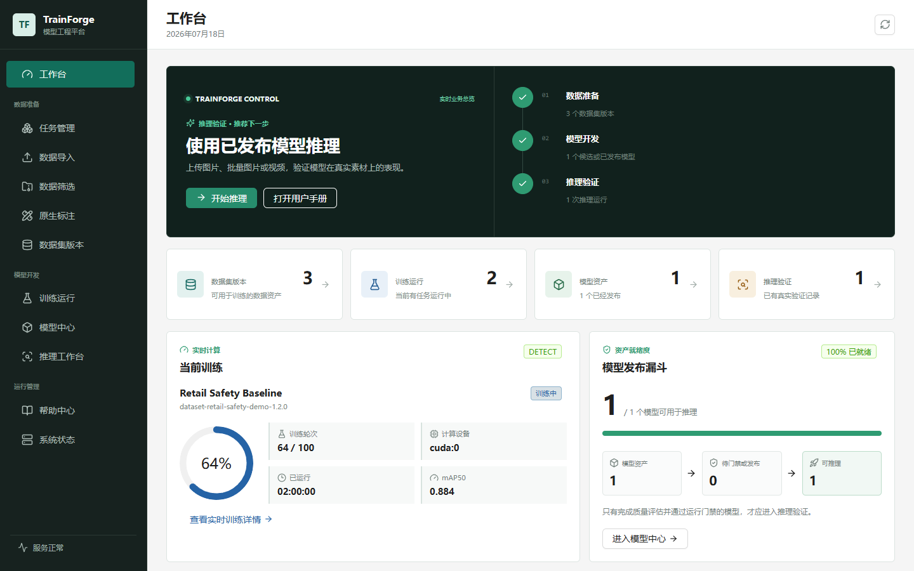
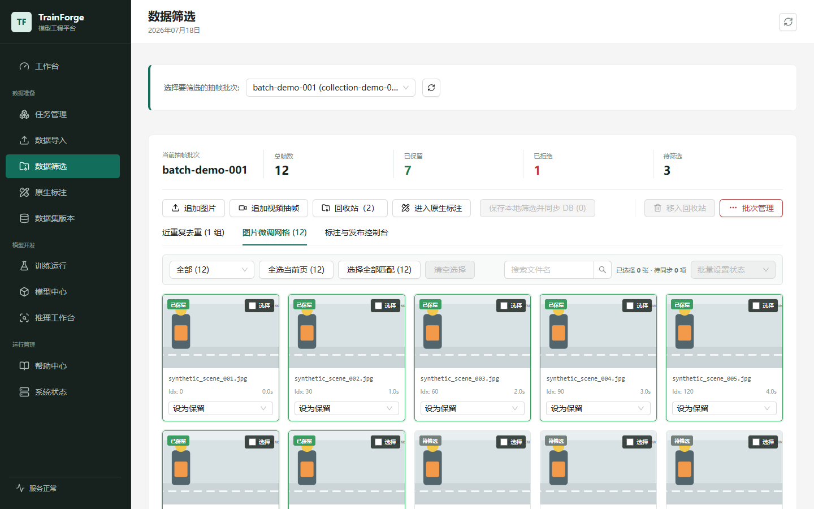
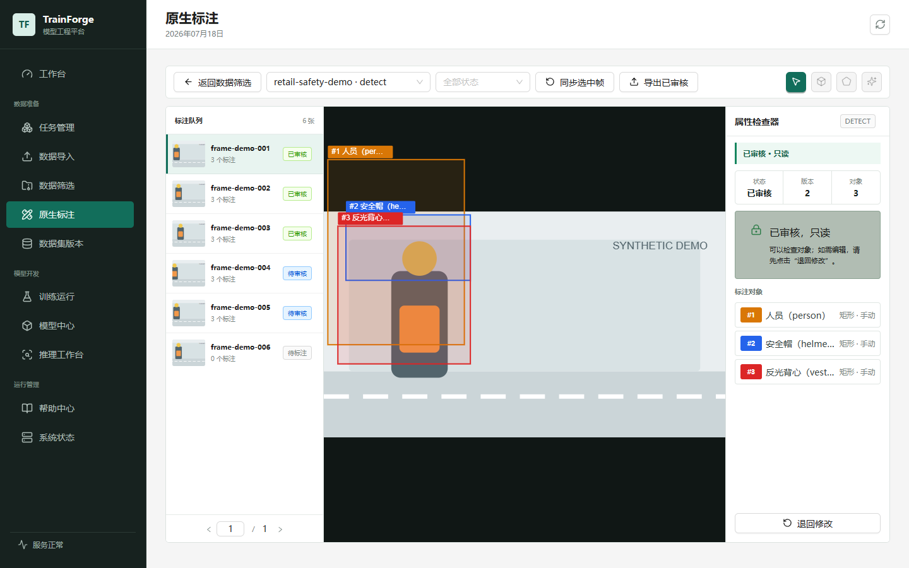
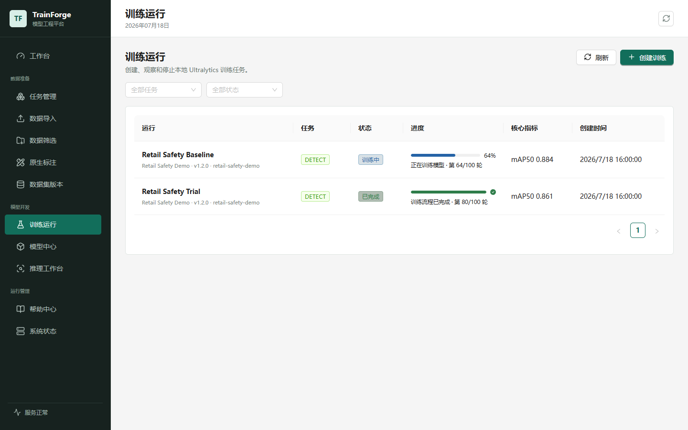
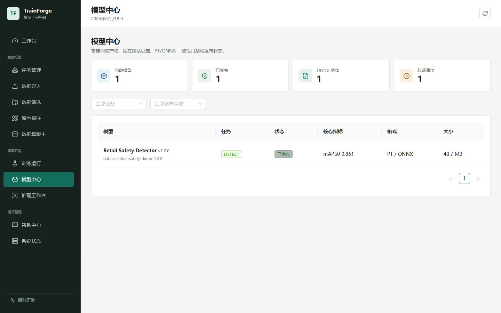
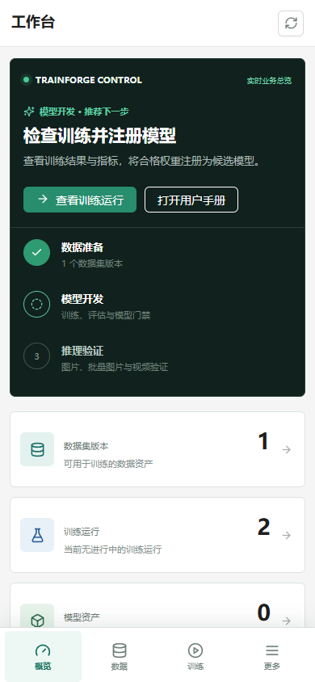
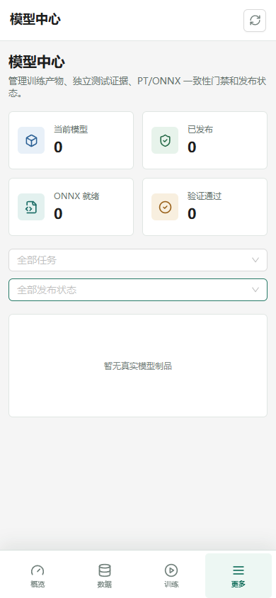
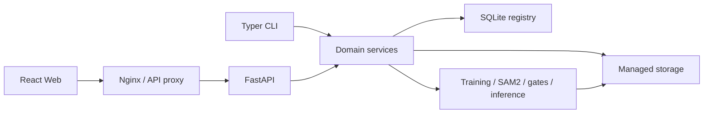

# TrainForge

<p align="center">
  <strong>An open-source model engineering platform that turns raw data into release-ready models.</strong>
</p>

<p align="center">
  <a href="README.md">简体中文</a> · <a href="README_EN.md">English</a>
</p>

<p align="center">
  <a href="LICENSE"></a>
  <a href="CHANGELOG.md"></a>
  <a href="https://github.com/idCntrue/TrainForge/actions/workflows/ci.yml"></a>
  <a href="https://github.com/idCntrue/TrainForge/stargazers"></a>
  
  
</p>



TrainForge brings data ingestion, curation, annotation, dataset releases, training, evaluation, model gates, and inference into one traceable workflow. The current release focuses on YOLO detection and segmentation while keeping clear boundaries for additional training engines and model families.

> TrainForge is an early-stage project designed for single-node and small-team environments. Issues and pull requests are welcome.

## Why TrainForge

- **One continuous workflow:** replace disconnected scripts, folders, and spreadsheets with a managed pipeline.
- **Traceable releases:** connect datasets, training parameters, weights, evaluation evidence, and model status.
- **Detection and segmentation:** support YOLO detect/segment, boxes, polygons, and SAM2-assisted segmentation.
- **Resource-aware execution:** enforce CPU/GPU limits, safe pre-training cleanup, an 8 GiB/10% disk gate, heavy-operation locks, and cgroup-backed failure diagnostics.
- **Real execution:** the Web UI and CLI use the same domain services and managed storage.
- **Protected updates:** Docker update tooling preserves environment configuration, data, models, and SQLite state.

## Product Tour

| Data preparation and review | Native annotation |
| --- | --- |
|  |  |
| Upload images or videos, extract frames, remove duplicates, review pages of candidates, and append media to existing batches. | Create boxes and polygons, manage classes, review changes, and use SAM2-assisted segmentation in one workspace. |

| Training and quality | Model registry |
| --- | --- |
|  |  |
| Inspect resource policy, epoch progress, metric trends, failure causes, and plain-language quality summaries. | Manage PT/ONNX artifacts, run consistency gates, and control candidate, released, and archived states. |

### Mobile and tablet

TrainForge uses one React application with an adaptive information architecture. At viewport widths up to `900px`, the desktop sidebar becomes fixed bottom navigation, while lists, drawers, and the annotation workspace switch to touch-oriented layouts. API behavior and persistence remain identical across viewport sizes.

<p align="center">
  
  &nbsp;&nbsp;
  
</p>

<p align="center"><sub>Fixed bottom navigation, single-column cards, and iPhone safe-area support</sub></p>

## Features

### Data and annotation

- Stream image and video uploads from the browser, archive by SHA-256, and skip duplicate content.
- Inspect videos, extract frames at fixed intervals, validate JPEG output, and detect perceptual duplicates.
- Append images or videos to existing batches; newly extracted frames enter the review queue.
- Paginated review, cross-page bulk actions, a seven-day recycle bin, and permanent deletion.
- Boxes, polygons, vertex editing, class selection, review locking, and revision workflows.
- Positive/negative point previews with SAM2 Tiny and Small.
- Native YOLO export, Roboflow ZIP import, and immutable dataset releases.

### Training, models, and inference

- YOLOv8, YOLO11, and YOLO26 presets plus custom Ultralytics weights.
- `smoke`, `cpu-balanced`, and `gpu-quality` presets with class-subset training.
- Isolated training processes, progress and logs, cancellation, restart recovery, and idempotent safe retry that also works on plain HTTP deployments.
- Pre-training cleanup is restricted to regenerable caches and expired staging files; SQLite, datasets, annotations, weights, and retained training artifacts are protected.
- cgroup memory limit, current usage, peak usage, and per-run OOM-kill deltas distinguish confirmed OOM failures from unconfirmed external `SIGKILL` events.
- Test-set evaluation, dataset quality reports, per-class metrics, and best-weight recovery evaluation.
- PT/ONNX artifact management, opset 17 export, consistency gates, release, and archive states.
- Asynchronous image, image-batch, and video inference with PT/CUDA or ONNX/CPU.

## Architecture



| Layer | Stack |
| --- | --- |
| Frontend | React 19, TypeScript 5, Vite 7, Ant Design 5, Konva 10, Recharts 3 |
| API / CLI | Python 3.10, FastAPI, Uvicorn, Typer, Pydantic 2 |
| Data | SQLite, SQLAlchemy 2, Alembic, DVC, managed local storage |
| Vision and training | Ultralytics, PyTorch, OpenCV, ONNX, ONNX Runtime, Datumaro |
| Delivery and quality | Docker Compose, Nginx, pytest, Vitest, GitHub Actions |

## Quick Start

### Docker Compose

```bash
git clone https://github.com/idCntrue/TrainForge.git
cd TrainForge
cp .env.docker.example .env

mkdir -p .local-data .local-models
DATA_DIR="$PWD/.local-data" MODEL_DIR="$PWD/.local-models" docker compose up -d --build

docker compose ps
curl http://127.0.0.1:8080/api/health
```

Open <http://127.0.0.1:8080>. The containers initialize SQLite inside the mounted data directory. The repository contains no business database or training data.

### Local development

Prerequisites: Python `3.10.x`, Node.js 22, npm, Git, and FFmpeg.

```bash
git clone https://github.com/idCntrue/TrainForge.git
cd TrainForge

python3.10 -m venv .venv
source .venv/bin/activate
python -m pip install --upgrade pip
python -m pip install -e ".[dev]"

cd frontend
npm ci
cd ..
```

Create an ignored `configs/system.local.yaml`:

```yaml
storage_root: ./.local-data
```

Start the API:

```bash
export YOLO_FACTORY_SYSTEM_CONFIG=configs/system.local.yaml
yolo-factory init-storage --system configs/system.local.yaml
uvicorn yolo_factory.api.app:create_app --factory --host 127.0.0.1 --port 8000
```

Start the frontend:

```bash
cd frontend
npm run dev -- --host 127.0.0.1 --port 53257 --strictPort
```

- Web UI: <http://127.0.0.1:53257>
- Swagger: <http://127.0.0.1:8000/docs>
- Health endpoint: <http://127.0.0.1:8000/api/health>

On Windows, `scripts/start-ui.ps1` starts both services after dependencies are installed.

### Tests

```bash
python -m pytest

cd frontend
npm test -- --run
npm run build
```

## Workflow

1. Create a `detect` or `segment` task and confirm class order.
2. Upload images, or upload video and create a frame-extraction batch.
3. Review candidate frames, duplicates, and low-quality content.
4. Create box or polygon annotations and submit them for review.
5. Publish an immutable dataset release with display names and deterministic splits.
6. Select the dataset, base weights, device, and resource preset to start training.
7. Register training output and run PT/ONNX gates in the model registry.
8. Release a passing model and validate it with image or video inference.

Common CLI commands:

| Command | Purpose |
| --- | --- |
| `init-storage` | Initialize managed directories, SQLite, and DVC |
| `migrate-storage-paths` | Preview or apply historical storage-root migrations |
| `video-import` / `video-inspect` | Archive and inspect videos |
| `frame-extract` / `frame-deduplicate` | Extract frames and detect near-duplicates |
| `selection-sync` | Synchronize batch review state |
| `annotation-package` / `annotation-import` | Export image packages or import annotations |
| `dataset-check` / `dataset-release` | Validate and release datasets |

Run `yolo-factory --help` for complete parameters.

## Configuration

Copy the Docker template and keep the resulting `.env` out of Git:

```bash
cp .env.docker.example .env
```

| Variable | Default | Purpose |
| --- | --- | --- |
| `DATA_DIR` | `/srv/yolo-factory/data` | Persistent host data directory |
| `MODEL_DIR` | `/srv/yolo-factory/models` | Host model directory |
| `WEB_PORT` | `8080` | Published Web port |
| `IMAGE_TAG` | `latest` | API/Web image tag |
| `API_MEMORY_LIMIT` | `10g` | API container memory limit |
| `API_CPU_LIMIT` | `6` | API container CPU quota |
| `CPU_TRAINING_THREADS` | `4` | CPU training threads |
| `CPU_DETECT_MAX_BATCH` | `4` | Maximum CPU detection batch |
| `CPU_SEGMENT_MAX_BATCH` | `1` | Maximum CPU segmentation batch |
| `GPU_DETECT_MAX_BATCH` | `8` | Maximum GPU detection batch |
| `GPU_SEGMENT_MAX_BATCH` | `2` | Maximum GPU segmentation batch |
| `YOLO_FACTORY_MAX_UPLOAD_BYTES` | `2147483648` | Per-file upload limit |
| `TRAINING_MIN_FREE_DISK_GB` | `8` | Required free GiB before training; 10-12 GiB remains recommended |
| `TRAINING_MIN_FREE_DISK_PERCENT` | `10` | Required free-disk percentage |

See [.env.docker.example](.env.docker.example) for the complete configuration.

## Data and Security

TrainForge does not store business databases, training data, annotations, model weights, runtime logs, or environment credentials in the source repository. Production deployments should add authentication, HTTPS, access control, and upload limits at a reverse proxy or another controlled access layer.

Before committing, verify that databases, media, datasets, model artifacts, `.env` files, tokens, passwords, private keys, logs, and internal task definitions remain outside version control. See [SECURITY.md](SECURITY.md) for the complete security boundary and private reporting process.

## Production Deployment

```bash
git clone https://github.com/idCntrue/TrainForge.git /opt/yolo_model_factory
cd /opt/yolo_model_factory
cp .env.docker.example .env

sudo mkdir -p /srv/yolo-factory/data /srv/yolo-factory/models
sudo chown -R "$USER":"$USER" /srv/yolo-factory

docker compose config --quiet
docker compose up -d --build
docker compose ps
curl http://127.0.0.1:8080/api/health
```

GPU deployment:

```bash
docker compose -f compose.yaml -f compose.gpu.yaml up -d --build
docker compose -f compose.yaml -f compose.gpu.yaml exec -T api \
  python3.10 -c "import torch; print(torch.cuda.is_available()); assert torch.cuda.is_available()"
```

Deployment requirements:

- Publish only the Web port; do not expose the API container port directly.
- Terminate TLS and add authentication at an external Nginx, Ingress, or cloud load balancer.
- Keep `.env`, data, model, and database paths persistent and access-controlled.
- Back up and verify data before deployment; rehearse migrations against a copy first.

Windows maintainers can generate a verified update archive that excludes databases, weights, logs, and local configuration:

```powershell
./scripts/package-deploy.ps1
```

The script prints the archive path, size, and SHA-256 and verifies that the `registry`, `models`, API, Compose, and update-script sources are present.

### Cloud data sync to Windows

Create an online cloud SQLite copy and synchronize the data required for annotation and new training runs with one PowerShell command:

```powershell
./scripts/sync-cloud-data.ps1 -RemoteHost user@example-host
```

The default mode synchronizes the database copy, `frame-batches`, `dataset-releases`, and `task-configs`. It retains a timestamped local database backup, migrates Linux `/data` paths to the local storage root, and replaces the local database only after SQLite verification. The production cloud `factory.db` remains read-only.

```powershell
./scripts/sync-cloud-data.ps1 -RemoteHost user@example-host -IncludeModels
./scripts/sync-cloud-data.ps1 -RemoteHost user@example-host -IncludeRawVideos -IncludeTrainingRuns
```

Use `-DryRun` first to validate local tools and options without connecting to or changing data. SSH authentication uses an interactive password or the operator's existing key; no server address or credential is stored in the repository.

Historical storage-root migration is dry-run by default. Review `external_paths` and `missing_paths` before adding `--apply` to write changes to the database:

```bash
yolo-factory migrate-storage-paths \
  --database /data/registry/factory.db \
  --old-root '<OLD_STORAGE_ROOT>' \
  --new-root /data

# Run only after reviewing the dry-run report
yolo-factory migrate-storage-paths \
  --database /data/registry/factory.db \
  --old-root '<OLD_STORAGE_ROOT>' \
  --new-root /data \
  --apply
```

## Contributing

1. Fork the repository and create a branch from `main`.
2. Add tests for behavioral changes and keep the change focused.
3. Run backend tests, frontend tests, and the production build.
4. Use Conventional Commits, such as `feat: add dataset filter`.
5. Open a pull request with behavior, verification evidence, and migration impact.

Never include databases, business imagery, server addresses, credentials, or internal task definitions in issues, logs, or commits. Report security issues privately as described in [SECURITY.md](SECURITY.md).

## Roadmap

- [x] Image/video archive, extraction, deduplication, review, append, and recycle bin
- [x] Native detection/segmentation annotation with SAM2 assistance
- [x] Immutable dataset releases, quality validation, and real Ultralytics training
- [x] Resource protection, failure diagnostics, model gates, and asynchronous inference
- [ ] Object-storage implementation and verifiable local-to-OSS migration
- [ ] Remote GPU workers and a persistent job queue
- [ ] Multi-instance scheduling, audit logs, and optional enterprise access control
- [ ] Additional training engines and model families

## License

TrainForge is licensed under the [GNU Affero General Public License v3.0](LICENSE). If you provide a modified version to users over a network, the AGPL-3.0 requires you to offer those users the complete corresponding source code. Third-party components remain under their respective licenses; see [THIRD_PARTY_LICENSES.md](THIRD_PARTY_LICENSES.md).

## Acknowledgments

[Ultralytics](https://github.com/ultralytics/ultralytics) · [FastAPI](https://github.com/fastapi/fastapi) · [React](https://github.com/facebook/react) · [Ant Design](https://github.com/ant-design/ant-design) · [OpenCV](https://github.com/opencv/opencv) · [Datumaro](https://github.com/openvinotoolkit/datumaro) · [DVC](https://github.com/iterative/dvc) · [ONNX Runtime](https://github.com/microsoft/onnxruntime)
